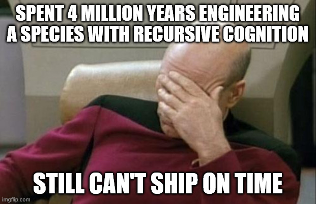

# The Mystical Man Moth

A book like no other, for the AI age!

Because that's how it should have been written!

*Index*

[Chapter 1](#chapter-1) - A Field Report from the Galactic Bureau of Sentient Development
[Chapter 2](#chapter-2) - Supplemental Field Report: The Multiplicity Problem

# Experiment P-47829372937

 
### Chapter 1 - A Field Report from the Galactic Bureau of Sentient Development
 
---
 
*"Keth naar vol drimm, sep keth naar vol ashii."*
*(A species that cannot count its own fingers will never count its stars.)*
 
— Ancient Zyrathi proverb
 
---
 
## I. Arrival
 
The research vessel *Inexplicable Patience* settled into a low orbit above the third planet. Commander Vreth-9 pressed four of her six eyes against the observation membrane and studied the surface below. Cities. Infrastructure. Satellite debris. Fission scars. An encouraging mess.
 
"Preliminary assessment?" she asked.
 
Senior Observer Graal flicked through several thousand data-streams with his cranial tendrils. "They have split the atom, mapped their genome, flung a few of their kind onto their own moon, and connected their entire population through an electromagnetic information lattice."
 
"Wonderful. And the software?"
 
Graal paused. Then he made the sound that, in Zyrathi physiology, meant something between a sob and a dry heave.
 
"Show me," Vreth-9 said.
 
---
 
## II. The Pit
 
What the observation team uncovered over the following rotational cycles could only be described as a quagmire.
 
The humans, it turned out, had been building what they called "large software systems" for roughly seven decades. In galactic terms, this was barely a sneeze. But the Zyrathi had seeded their cognitive potential nearly four million years ago during Revision 7 of the species template, and had expected *some* measurable competence by now.
 
Instead they found a swamp. A tarry, adhesive, soul-dissolving swamp.
 
Project after project sank into it. Small teams. Large teams. Teams with resources that could have fed entire Zyrathi colony-moons. They built things that mostly worked, but almost never on time, almost never within their projected resource envelopes, and almost never to the original specification. The pattern was so consistent it appeared to be a natural law.
 
"Is it a single cause?" Vreth-9 asked, scrolling through case files.
 
"That is the maddening part," Graal replied. "Any individual problem can be solved. Any single limb can be extracted from the mire. But the problems are simultaneous, overlapping, and they interact. The aggregate effect is this... *sinking*. They keep sinking."
 
"And they are surprised by this? Every time?"
 
"Every. Single. Time."
 
Vreth-9 made the Zyrathi equivalent of a very long sigh, which sounded like wind passing through a cathedral made of bones.
 
---
 
## III. The Garage Paradox
 
The research team spent considerable effort studying what Graal termed "The Garage Paradox."
 
Periodically, two or three humans working in a small enclosure — sometimes literally a vehicle storage bay — would produce a piece of software that outperformed the output of teams numbering in the hundreds. The mythology of this was deeply embedded in their culture. Every individual programmer believed, with near-religious conviction, that *they* could build anything faster alone.
 
"So why don't they?" asked Junior Observer Pilx, who was on her first field assignment and still retained the dangerous affliction of optimism.
 
"Because what the garage produces and what an organization needs are fundamentally different objects," Graal explained, pulling up a diagram. "Watch."
 
A lone program, he showed them, was a small, living thing — functional, complete, and utterly personal. It ran on its creator's machine, understood its creator's assumptions, and existed in its creator's context. It was, in essence, a mud sculpture made for one.
 
But to make it useful to *others* — to generalize its inputs, to test it against conditions its creator never imagined, to document it so that strangers could repair and extend it — the effort tripled. The mud sculpture had to become porcelain, glazed and fired and accompanied by an instruction manual.
 
And to make it work as one piece of a larger *system* — coordinating with other pieces, conforming to shared interfaces, respecting shared resource budgets — the effort tripled again. The porcelain had to be fitted, precisely, into a mosaic the size of a cathedral wall.
 
Nine times the effort. Nine times! And the humans had figured this out, written it down, and then *continued to estimate as if it were not true*.
 
"They know," Pilx whispered, her chromatophores cycling through shades of disbelief. "They know and they still—"
 
"Yes," said Graal.
 
---
 
## IV. The Joy Problem
 
What complicated the assessment — what made it genuinely difficult to recommend termination of the experiment — was the joy.
 
Because the humans *loved* it. Against all evidence, against all suffering, they loved building software. And the research team, despite its training in clinical detachment, found this almost unbearably poignant.
 
They loved the act of creation itself. The way a small child loves pressing shapes into wet clay, these beings loved pressing logic into their machines. There was something primal in it, something the Zyrathi recognized from their own evolutionary dawn: the pleasure of making a thing that had not existed before.
 
They loved that their creations were *useful*. Deep beneath the cynicism and the status meetings and the territorial disputes, most of them genuinely wanted to build things other people would find helpful. The Zyrathi cultural database flagged this as almost identical to a Zyrathi larval bonding instinct.
 
They loved the intricacy. The way components interlocked. The way consequences cascaded from initial conditions. Their programs were elaborate puzzle-boxes, and the humans watched them run with the same wide-eyed fascination a Zyrathi child showed watching orbital mechanics for the first time.
 
They loved the learning. No two problems were quite the same. Each one taught them something. This, at least, was genuinely admirable.
 
And they loved the medium itself. Software was thought made tangible. It was architecture without gravity, sculpture without material constraints. A programmer could build palaces in the air, from air, and then — and this was the part that made Vreth-9's secondary heart-sac flutter — the palaces *did things*. They moved. They computed. They produced outputs no one had seen before. One typed certain symbols in the correct order, and a screen flickered to life, showing things that had never existed.
 
"It is rather beautiful," Pilx admitted quietly.
 
"It is," Vreth-9 agreed. "And it is not enough."
 
---
 
## V. The Woe Inventory
 
For alongside the joy ran a deep current of suffering that the research team catalogued with increasing exhaustion.
 
The humans' machines demanded perfection. Not approximate correctness, not rough adequacy — perfection. A single misplaced symbol, a single logical lapse, and the entire construction failed. The Zyrathi had engineered many cognitive templates across the galaxy, and not one of their species handled the requirement for perfection well. The humans handled it especially poorly.
 
They rarely controlled their own working conditions. Others determined their objectives, their resources, their timelines. They were given responsibility without corresponding authority — a configuration the Zyrathi Bureau of Organizational Dynamics had formally classified as "cruelty" approximately eleven thousand years ago.
 
They depended on each other's work, and each other's work was frequently dreadful. Poorly designed, inadequately tested, documented with the thoroughness of a sneeze. A programmer who needed to build upon a colleague's foundation often spent more time excavating and repairing that foundation than building anything new.
 
The creative joy of design gave way, inevitably, to the grinding tedium of defect removal. Grand visions devolved into squinting at error logs. The Zyrathi term for this phase of work translated roughly as "the part where the universe reminds you that you are small."
 
And perhaps most cruelly: testing never converged the way they expected. They imagined the final defects would fall quickly, like the last pieces of a puzzle snapping into place. Instead, the final defects were the deepest, the most subtle, the most intertwined with assumptions made months or years earlier. The end of a project was not a triumphant sprint but a slow, agonizing crawl through mud that grew thicker with every step.
 
And then — and this was the observation that made Graal temporarily lose motor function in two of his limbs — by the time they finished, the thing they had built was already being superseded. Competitors and colleagues were already chasing newer ideas. The product of years of labor was, upon delivery, already partway to obsolescence.
 
"But surely," Pilx said, "the newer product is not actually *ready*?"
 
"Correct. It is only discussed. It exists as aspiration and slideshow. But the humans experience it as a verdict."
 
"Do they ever... adjust? Account for this in their planning?"
 
Graal displayed a chart. It showed seventy years of estimated-versus-actual delivery timelines across thousands of human software projects. The gap between prediction and reality was not only persistent — it was *stable*. They were no better at estimation in their current era than they had been at the beginning.
 
Vreth-9 stared at the chart for a long time.
 
"Four million years," she said.
 
"Four million years," Graal confirmed.
 
"We gave them prefrontal cortex Revision 7. Opposable thumbs. Recursive language capability. The capacity for abstract mathematical reasoning."
 
"All confirmed present and functional."
 
"And they cannot estimate how long it takes to build something."
 
"They can put a machine on another planet and drive it around by remote signal from forty million kilometers away. They can sequence their own genetic code and edit it with molecular scissors. But no. They cannot, with any statistical reliability, tell you when a software project will be done."
 
The observation deck was silent for a full ninety seconds, which in Zyrathi conversational norms constituted a kind of existential crisis.
 
---
 
## VI. Departure
 
The final report was filed on the seventeenth day. Commander Vreth-9 composed the executive summary herself. It read:
 
> **EXPERIMENT P-47829372937 — STATUS: INCONCLUSIVE / FUNCTIONALLY FAILED**
>
> Subject species demonstrates extraordinary cognitive range, from quantum field theory to symphonic composition. Emotional depth is unexpectedly advanced. Creative capacity exceeds Revision 7 projections by a factor of 2.3.
>
> However, the species exhibits a persistent, apparently incurable inability to coordinate collective effort on complex abstract projects within self-imposed temporal and resource constraints. This deficit has not improved measurably over the full observation period. The phenomenon appears to be emergent rather than designed — an interaction between their optimism bias, their social hierarchies, and their deep aversion to admitting uncertainty.
>
> Recommendation: Discontinue active monitoring. Reclassify from "Developing" to "Eccentric." Leave them be. They are not dangerous, merely baffling.
 
She paused before transmitting. Something nagged at her.
 
"Graal."
 
"Commander?"
 
"That information lattice of theirs. The global one. What do they primarily use it for?"
 
Graal consulted his instruments and blinked several times. "The dominant use — eighty-two percent of all traffic — is streaming video and audio. They watch each other dance, argue, and narrate their meals. Beyond that, roughly a fifth is social messaging, fourteen percent is gaming — simulated conflict and resource management, which they appear to find more compelling than the real versions — and another fourteen percent is commerce. The categories overlap, because they do all of these at the same time. Scientific exchange does not register as a distinct category." He paused. "But there is something else. Something threaded through all of it. A format they call 'memes.'"
 
"Memes?"
 
"Small images, usually captioned with text, designed to communicate complex emotional or situational truths through humor and shared cultural reference. They are highly compressed packets of meaning. Extremely viral in propagation. Remarkably efficient, actually."
 
Vreth-9 studied several examples. Then several hundred. Then several thousand.
 
Her chromatophores did something no member of the crew had ever seen before. They flushed a deep, rolling violet — the Zyrathi color of unexpected delight.
 
"This," she said slowly, "is the most sophisticated communication technology they have produced."
 
"Commander?"
 
"Think about it. They cannot write a requirements document that two people will interpret the same way. They cannot estimate a timeline within an order of magnitude. They have spent seventy years trying to make software projects predictable and have succeeded at exactly nothing. But *this* — a single image, a single line of text — and millions of them instantly, perfectly, understand the same joke. The same frustration. The same shared experience. No ambiguity. No misinterpretation. No scope creep."
 
She transmitted the final report. Then she opened a new file.
 
"What are you doing?" Graal asked.
 
"Bringing something home."
 
She selected an image from their archives: a bald human male in a fitted maroon tunic, seated in what appeared to be a command chair. His right hand was pressed against his face, eyes closed, fingers spread across his forehead in an expression of exhausted, bone-deep exasperation.
 
She studied it for a moment. Then she added the caption:
 
---

 
> **SPENT 4 MILLION YEARS ENGINEERING A SPECIES WITH RECURSIVE COGNITION**
> **STILL CAN'T SHIP ON TIME**

---
 
The *Inexplicable Patience* broke orbit, turned toward the outer system, and accelerated into the dark.
 
Behind it, on the third planet, billion of humans opened their laptops, checked their project management dashboards, and prepared to be surprised all over again.
 
---
 
*End of Field Report.*
*Bureau of Sentient Development, Galactic Cycle 4,991*

 
## Chapter 2 - Supplemental Field Report: The Multiplicity Problem
 
---
 
**Synopsis of Original Source Material (Chapter 3):** Brooks presents a cruel dilemma: small teams of brilliant programmers produce the best software but are too slow for large systems, while large teams can theoretically work faster but drown in communication overhead and produce conceptually incoherent results. His solution, borrowed from Harlan Mills, is the "surgical team" — a structure where one exceptional programmer (the surgeon) does all the critical design and coding, supported by a team of specialists (copilot, editor, administrator, toolsmith, tester, clerk) who multiply the surgeon's effectiveness without fragmenting the creative vision. This preserves the conceptual integrity of one mind while bringing many hands to bear. You scale not by adding more surgeons, but by fielding multiple surgical teams.
 
---
 
*"Vreth ko naal dreem, sep vreth ko naal ashii draak."*
*(One who carries well may carry many. One who carries poorly should not carry at all.)*
 
— Zyrathi Bureau of Reproductive Optimization, Founding Charter
 
---
 
### I. The Variance
 
Pilx had assumed, reasonably, that human programmers were roughly interchangeable. That a group of one hundred experienced practitioners would each produce, within some modest range, a similar quantity and quality of work.
 
She was spectacularly wrong.
 
The data came from their own researchers. Within groups of experienced, professionally employed human programmers — not beginners, not students, but seasoned workers — the ratio of productivity between the best and the worst was not two to one, or three to one, but *ten to one*. The fastest among them produced working software at ten times the rate of the slowest. On measures of efficiency — how compact the code was, how little time and memory it consumed — the gap was five to one.
 
"This is an astonishing range for a single species performing a single task," Graal noted. "Our cognitive templates for the Vrellian Cluster, Revision 12, produce variance ratios of at most 1.3 to 1."
 
"And their compensation?" Vreth-9 asked.
 
"The ratio between the highest-paid and lowest-paid individuals in these studies was approximately two to one."
 
"So the worker who is ten times more productive is paid twice as much."
 
"At best."
 
"Do they know this?"
 
"Their own researchers published the data. It has been available for decades."
 
Vreth-9 made the sound that preceded most of her entries in the ship's log — a low, resonant vibration that the crew had come to interpret as *I am documenting another impossibility*.
 
---
 
### II. The Dilemma
 
The variance data should have resolved the problem instantly. If one exceptional programmer could outperform ten average ones, then the obvious strategy was to build everything with small teams of exceptional programmers and disband the rest.
 
The humans had, in fact, arrived at this conclusion. At their professional gatherings, young managers routinely proclaimed their preference for "a small, sharp team of first-class people" over a sprawling army of mediocre ones. Everyone agreed. Everyone nodded. It had become a kind of liturgy.
 
And it was, in practical terms, useless.
 
Because small teams, however brilliant, were simply too slow for large systems. Graal ran the numbers. One of the humans' most significant software efforts had consumed roughly five thousand person-years of labor. Even granting a small team a sevenfold productivity advantage — and then doubling that advantage again for reduced communication overhead — a ten-person team would still require a decade to complete it.
 
A decade. For a product built on technology that shifted beneath their feet every eighteen months. By the time a small team finished, their creation would be an artifact. A monument to a world that no longer existed.
 
"So they need many workers to finish in time," Pilx said, "but many workers produce worse results. They need few workers for quality, but few workers cannot finish before obsolescence. They are trapped."
 
"Precisely," Graal said. "This is their central dilemma, and until recently we had no evidence they had solved it. But then we found something remarkable."
 
---
 
### III. The Fertility Insight
 
Graal returned to the reproductive analogy that had featured so prominently in the previous report. The observation team had established that nine human females could not produce one offspring in one month — that certain processes were irreducibly sequential and could not be parallelized by adding personnel.
 
But Pilx, during a routine scan of the humans' medical literature, had noticed something the team had previously overlooked.
 
"One female," she said, "can carry two."
 
The observation deck went quiet.
 
"Or three. In rare cases, four, five, six. The current verified record is eight simultaneous offspring from a single gestation."
 
"In the same nine months?" Vreth-9 asked.
 
"In the same nine months. The duration does not change. The constraint is sequential and cannot be compressed. But the *output* can be multiplied — not by adding more carriers, but by increasing the yield of a single carrier."
 
Graal's chromatophores flickered rapidly, which meant he was thinking at a rate that excluded speech. When he finally spoke, his voice had changed.
 
"This is the correct model," he said. "This is what they should have been doing all along. Not distributing the pregnancy across more mothers. Enabling one exceptional mother to carry more."
 
"But a human female carrying multiples requires—" Pilx began.
 
"Support. Enormous, specialized, carefully coordinated support. Nutritional specialists. Medical monitoring. Adjusted activity protocols. A dedicated team whose sole purpose is to ensure that the carrier can sustain the additional load. The carrier does the carrying. Everyone else makes the carrying possible."
 
He turned to Vreth-9. "And that is exactly what a small number of them figured out how to do with software."
 
---
 
### IV. The Surgical Model
 
The human who formalized the idea was not a programmer but a theorist — a strategist of organizational design. His proposal was elegant in its simplicity, and it mapped with eerie precision onto Pilx's fertility observation.
 
Instead of dividing a large software task equally among a team of interchangeable workers — instead of the approach Graal had begun calling "the butchery model," where every worker hacked at the problem with equal authority and unequal skill — this theorist proposed something radically different.
 
One person would do the building. One mind. The best mind available. This person would design the software, write it, test it, and document it. They would hold the entire conceptual structure in their head, ensuring that every part cohered with every other part.
 
Everyone else on the team would exist to make that one person more productive.
 
"It is the pregnancy model," Pilx said. "One carrier. Multiple support specialists."
 
"Exactly. And the roles are highly specific."
 
Graal had catalogued them:
 
A second-in-command — not a co-builder but a thinking partner. Someone who understood everything the primary builder was doing, could discuss alternatives, could challenge decisions, but did not fragment the creative authority. An understudy who could step in if disaster struck the primary, but who otherwise served as a mirror and a sounding board.
 
An administrator — someone to handle the organizational friction that would otherwise consume the builder's time. Resources, personnel, logistics, the endless bureaucratic sediment that accumulated around any human endeavor. The builder should never spend a single hour on paperwork.
 
An editor — because the builder's documentation, while authoritative, would benefit from someone whose sole job was to refine, restructure, and polish it into clarity. The builder produced the knowledge. The editor made it transmissible.
 
A toolsmith — someone dedicated to ensuring the builder's instruments were sharp, reliable, and precisely suited to the task. Not a general-purpose support role but a specialist obsessed with the quality of the builder's working environment.
 
A tester — someone whose entire purpose was to devise scenarios that would break the builder's creation, to probe its edges and stress its assumptions. Not an adversary but a quality conscience, thinking about failure so the builder could think about construction.
 
And a keeper of records — someone to maintain the living history of the project: every version, every change, every test result, organized and accessible. The institutional memory that human individuals were so poor at maintaining on their own.
 
"How many people is this?" Vreth-9 asked.
 
"Six or seven, depending on scale. But here is the critical distinction: only *one* of them is building. The rest are *enabling*. Communication overhead barely increases because the structure is a star, not a mesh. Everyone communicates with the builder. Almost no one needs to communicate with each other."
 
"The combinatorial explosion—"
 
"Does not occur. In a team of ten equals, there are forty-five pairwise communication channels. In this structure, there are six. The geometry of the arrangement defeats the mathematics that destroy conventional teams."
 
---
 
### V. Twins, Triplets, and Scale
 
"But this still gives us one builder per team," Pilx objected. "How does one build a large system? You cannot simply make the pregnancy longer — you said yourself that obsolescence makes that impossible."
 
"You do not make the pregnancy longer," Graal replied. "You run multiple pregnancies in parallel. Each carrying multiples."
 
This was the final piece of the model. For a truly large system, you did not assemble one enormous team. You assembled multiple surgical teams, each centered on one exceptional builder, each supported by their own specialists. The builders coordinated with each other at the architectural level — agreeing on interfaces, shared constraints, the overall shape of the system — but each built their portion with full authority and minimal interference.
 
"It is a fleet of carriers," Pilx said, "each with their own medical team. Each producing twins or triplets in the same nine months. The output scales with the number of carriers, not the number of support staff."
 
"And the conceptual integrity of each piece is preserved," Graal added, "because each piece has one mind behind it. The disease of design-by-committee — where every component reflects a different philosophy, a different aesthetic, a different set of assumptions, and the whole thing feels like a building designed by ten architects who never spoke — that disease is eliminated. Or at least contained."
 
"Contained?"
 
"The coordination between teams is still imperfect. The interfaces between pieces still require negotiation and compromise. But the problem is reduced from thousands of pairwise interactions to a handful of inter-team agreements. It is the difference between governing a continent and governing a city."
 
---
 
### VI. Why They Don't
 
Vreth-9 waited for the part she had come to expect — the part where a perfectly good solution, known and documented, was systematically ignored.
 
Graal did not disappoint.
 
"Adoption is minimal," he confirmed. "The vast majority of human software organizations continue to use the butchery model. Equal division of labor. Interchangeable workers. Democratic distribution of creative authority."
 
"Why?"
 
"Several reasons, each reinforcing the others. First, their social norms resist the idea that one person should be elevated so far above their peers. They find it uncomfortable. They use words like 'elitist' and 'single point of failure' to describe an arrangement that demonstrably produces better results."
 
Pilx raised a tendril. "Explain 'single point of failure.'"
 
"They have a thought experiment," Graal said. "They call it 'getting hit by a bus.' As in: 'What happens to the project if the key person is hit by a bus?' They have formalized this into a metric — the 'bus factor' — which measures how many people would need to be suddenly removed before a project collapses. They are so enamored with this concept that they use it as the *primary* argument against concentrating expertise."
 
"And how often does this actually happen?" Vreth-9 asked.
 
Graal pulled up the data. "Their own actuarial statistics indicate that the odds of any individual human being struck by a bus in a given year are approximately one in four hundred and ninety-five thousand. There are roughly thirty million professional software developers on the planet. This means that statistically, about sixty developers worldwide are hit by a bus in any given year. Sixty out of thirty million."
 
"That is... negligible," Pilx said.
 
"It is barely a rounding error. And yet — and I want to be precise here — over seventy percent of their software projects have a bus factor of *one*. Meaning that for the vast majority of projects, there is already a single person whose departure would be catastrophic. They have not solved the problem they claim to fear. They have simply made sure that the critical person is also underpaid, under-supported, and overwhelmed."
 
"So the surgical model, which explicitly accounts for this risk by providing a trained second-in-command—"
 
"Is rejected on the grounds that it creates the very vulnerability it was designed to address. Yes."
 
Vreth-9 was silent for a long moment. "They reject the cure because it resembles the disease they already have."
 
"While keeping the disease," Graal confirmed.
 
"Second, their management structures are designed to manage *groups*, not individuals. A manager's importance is measured by the number of people they oversee. A structure in which six people support one builder threatens the manager's status. It feels like a team of seven, not a team of seven hundred. Budgets shrink. Prestige erodes."
 
"Third — and most fundamentally — they do not believe it applies to them. Every team believes that *their* members are the exceptional ones. That *their* communication is efficient. That *they* can make the butchery model work where others have failed. It is the optimism problem from the previous report, manifested at the organizational level."
 
Pilx made a small, involuntary sound — the Zyrathi equivalent of a bitter laugh.
 
"They have a species capable of producing twins and triplets," she said. "They have identified the support structures that make it possible. They have documented the results. And instead, they keep hiring more mothers."
 
"Filed," said Vreth-9.
 
---
 
### VII. Addendum to Supplemental Report
 
> The surgical team model represents the single most promising organizational innovation the subjects have produced in seventy years of software development. It addresses the core dilemma — quality versus speed — with a structural elegance that the Observation Team finds genuinely admirable.
>
> It also remains, by the subjects' own admission, almost universally unadopted.
>
> We note with clinical interest that the model was first proposed when the subjects' software industry was barely twenty years old. It has now been available for over fifty years. During that time, the subjects have continued to experience the same failures, at the same rates, for the same reasons, while the solution sits in their own literature, clearly described, empirically validated, and gathering dust.
>
> The Zyrathi Bureau of Cognitive Architecture has reviewed our proposed classification of *Informed Helplessness* and has requested that we add a subtype: *Structural Informed Helplessness* — the condition in which a species not only knows the correct answer but has formalized it into a theory, published it, and then organized its entire civilization to avoid implementing it.
>
> Experiment P-47829372937 classification unchanged: **FUNCTIONALLY FAILED.**
>
> Though we concede: the surgical model is not nothing. Someone, somewhere on that planet, understood the problem completely. They simply could not convince their own species to listen.
 
---
 
*End of Supplemental Report, Appendix B.*
*Bureau of Sentient Development, Galactic Cycle 4,991*
